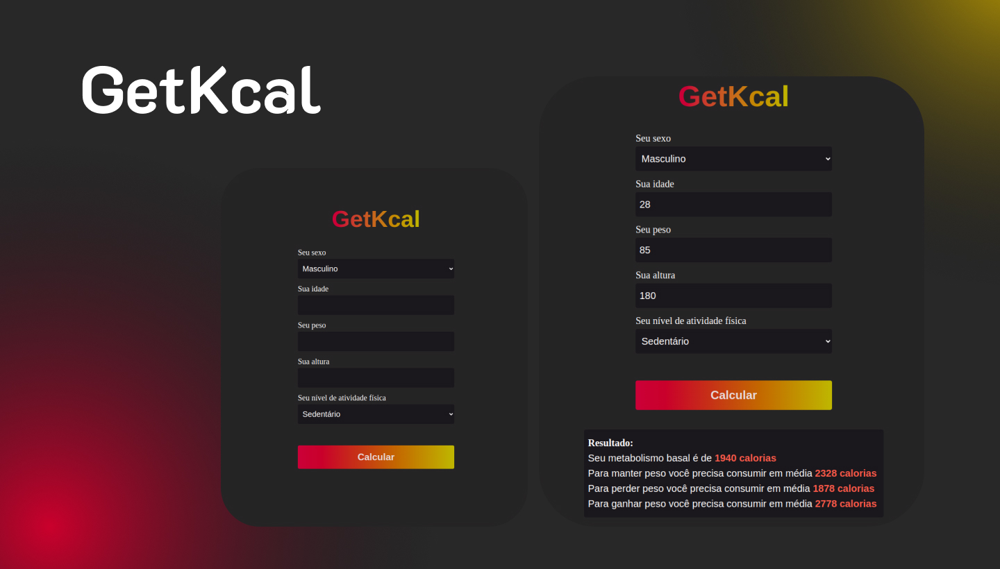

# Getkcal

## Technologies used

This project was done using the following technologies

 **Javascript**

 **HTML**

 **CSS**

## Objective of project

The function of this project is to function as a IMC calculator and, in addition, calculate how many calories on average a person would need to consume to lose weight, lose weight or gain weight.

Its use is excellent as it provides a quick and accurate calculation for those who want to have a more specific idea of what they need to do to stay healthy.

## What I learned from this project

Even though it's a small project, it has a lot to teach those just starting out. The things that were most interesting to me in particular were the DOM manipulation and some styling.
